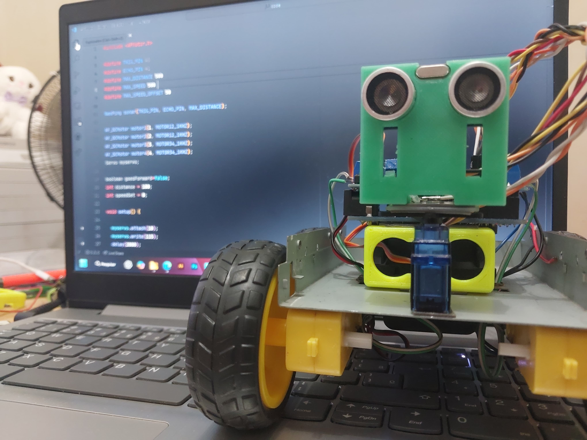
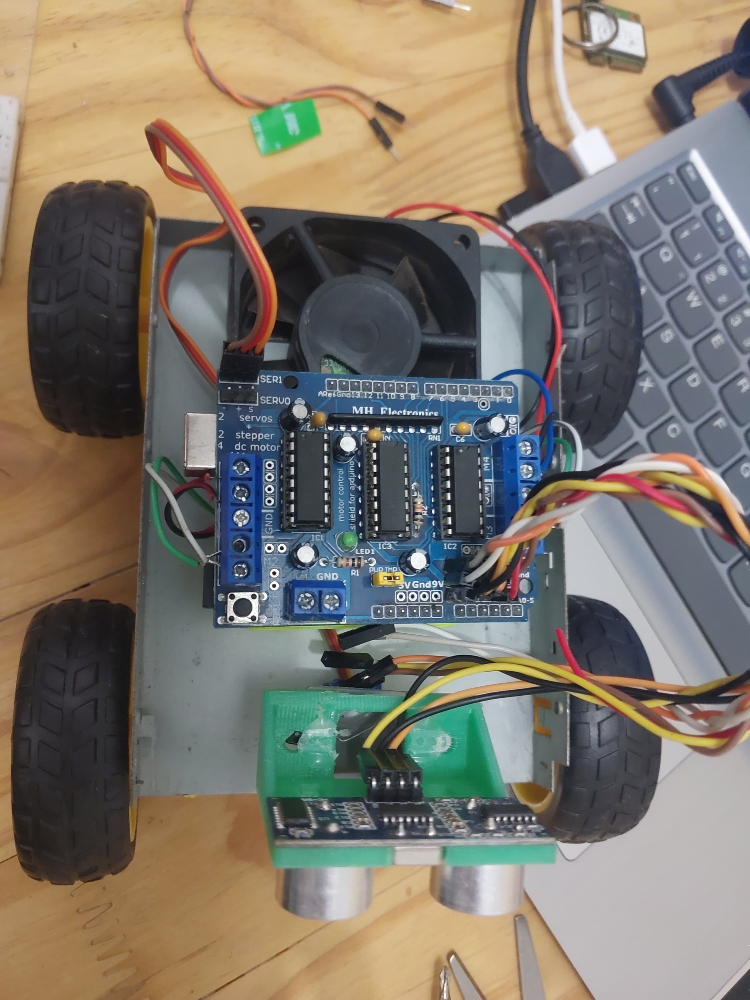
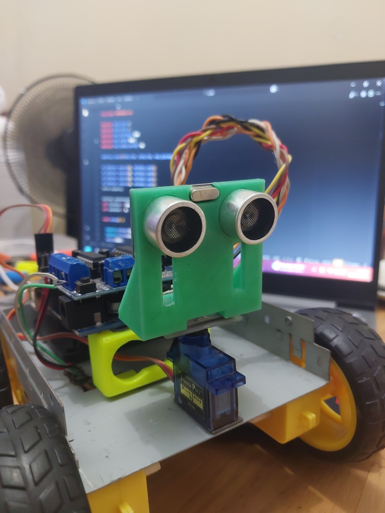

# Reboot
Projeto de robô seguidor de linha e desviador de obstáculos, desenvolvido com Arduino Uno

🌀 Reboot
Reboot é um projeto pessoal criado por mim, Richardt Justke — designer gráfico e estudante de Ciência da Computação na UDF — com o objetivo de unir criatividade e código. Esse repositório representa um "reinício" na minha jornada como dev.

Mais do que um código, o Reboot é um marco da minha transição profissional para o universo da tecnologia. Ele é o espaço onde experimento ideias, estudo boas práticas e evoluo como programador com foco em alcançar oportunidades internacionais.
# 🤖 Reboot

